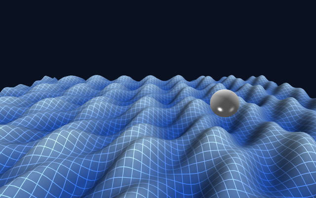

# Stargine: A Mojo Game Engine
Stargine is a proof-of-concept game engine written entirely in [Mojo](https://www.modular.com/mojo), using OpenGL for graphics rendering. The goal of this project is to explore Mojo's potential for high-performance game development and its interoperability with existing graphics APIs.

<p align="center">

</p>


## Current Status

The engine is in an early experimental stage. Here's what's currently implemented:
-   ✅ Window and OpenGL 4.5 core context via SDL3 bindings, with 4x MSAA, a
    24-bit depth buffer, sRGB rendering and GL debug messages.
-   ✅ Cube, plane and sphere primitives, with indexed meshes and compile-time vertex layouts.
-   ✅ Point and directional lights, textured materials, and hand-written GLSL materials.
-   ✅ Cube-map skyboxes.
-   ✅ Loading and compiling GLSL shaders, with uniform-location caching.

Planned next, roughly in order: a shader module system users can build custom
materials on, a renderer that batches instead of re-binding per object, glTF
import, collision queries, and an ECS once the layers under it have settled.

## Getting Started

To start you need to have [Pixi](https://pixi.sh/latest/) and Git installed

### Installation

```bash
git clone https://github.com/ssslakter/stargine.git
cd stargine
pixi run assets            # generates the procedural textures the examples use
pixi run example cube
```

If SDL picks the wrong video backend for your desktop, set it explicitly, e.g.
`SDL_VIDEODRIVER=wayland pixi run example cube`.

### Examples

Each directory under `examples/` is a standalone program that uses the engine as
a library. See [examples/README.md](examples/README.md) for what each one covers
and screenshots.

```bash
pixi run example cube           # a textured, lit crate
pixi run example solar_system   # spheres, orbits and a cube-map skybox
pixi run example wave_field     # a plane displaced by a custom vertex shader
```

### Tests

```bash
pixi run test linalg   # unit tests for the vector and matrix types, no display needed
pixi run test smoke    # renders a scene off-screen and checks for GL object leaks
pixi run test bench    # frame time p50/p99/max against 10-1000 cubes
```

Both terminate on their own, so they are the useful checks after a change.
`smoke` needs a real display (or Xvfb).

## Project Structure

-   `stargine/core`: Core engine modules (event handling, GPU abstractions, math, rendering, windowing).
-   `stargine/scene`: Cameras, transforms, meshes, materials and lights.
-   `stargine/primitives`: Ready-made shapes and the skybox.
-   `stargine/custom_shaders`: spare GLSL sources, not wired into the engine yet.
-   `examples`: Standalone demo programs and their shared assets.

## About Mojo Kernels and OpenGL

It is theoretically possible to use Mojo kernels directly with OpenGL through certain [NVIDIA driver APIs](https://docs.nvidia.com/cuda/cuda-runtime-api/group__CUDART__OPENGL.html), which could unlock significant performance gains and open larger possibilities, though there is a limited support for this.

The current reliance on traditional C graphics APIs is a major limitation for writing idiomatic Mojo. With OpenGL, this results in awkward workarounds like building shaders by concatenating strings.

While migrating to a modern API like Vulkan would be a significant improvement—using pre-compiled shader bytecode instead of strings—it still operates across a C-API boundary. This prevents the deep, seamless integration that Mojo's heterogeneous compute model promises. I hope this project inspires work toward a future where Mojo can target the graphics pipeline as a first-class citizen.
