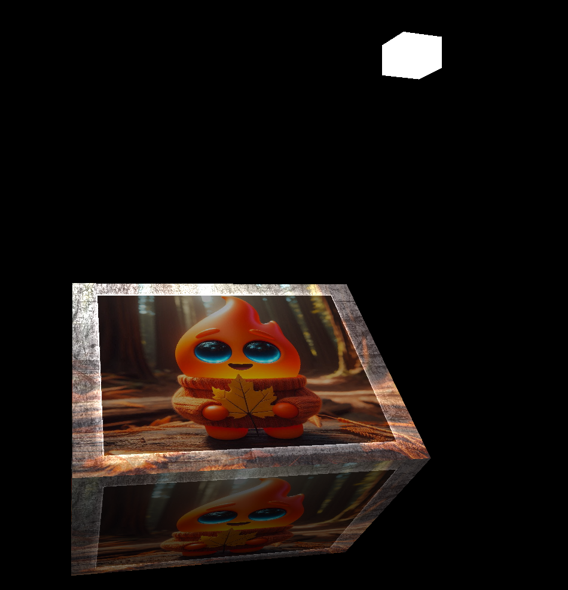

# Stargine: A Mojo Game Engine
Stargine is a proof-of-concept game engine written entirely in [Mojo](https://www.modular.com/mojo), using OpenGL for graphics rendering. The goal of this project is to explore Mojo's potential for high-performance game development and its interoperability with existing graphics APIs.

<p align="center">

</p>


## Current Status

The engine is in an early experimental stage. Here's what's currently implemented:
-   ✅ Window and OpenGL context creation via SDL3 bindings.
-   ✅ Rendering of basic 3D primitives (e.g., a colored cube).
-   ✅ A basic Entity-Component-System (ECS) architecture.
-   ✅ Loading and compiling GLSL shaders.

## Getting Started

To start you need to have [Pixi](https://pixi.sh/latest/) and Git installed

### Installation

```bash
git clone https://github.com/ssslakter/stargine.git
cd stargine
pixi run app
```

*Note: The `pixi.toml` file sets `SDL_VIDEODRIVER="wayland"` by default. You may need to change this depending on the desktop environment*

### Examples and tests

Each directory under `tests/` is a standalone example, run by name:

```bash
pixi run test smoke           # renders a few frames and checks for GL object leaks, then exits
pixi run test basic_buffers   # a coloured quad from an index buffer
pixi run test texture         # the same quad, textured
```

`smoke` is the one that terminates on its own, so it is the useful check after a change; the other two open a window until you press ESC. All of them need a real display (or Xvfb).

The engine tracks the Mojo nightly channel, and requires the OpenGL and SDL3 bindings from
[opengl-mojo](https://github.com/MojoGameDevs/opengl-mojo) and [sdl-mojo](https://github.com/MojoGameDevs/sdl-mojo).

## Project Structure

-   `stargine/core`: Core engine modules (event handling, GPU abstractions, math, rendering, windowing).
-   `stargine/ecs`: The Entity-Component-System
-   `stargine/primitives`: Basic geometric primitives like cubes and squares
-   `stargine/custom_shaders`: GLSL shader files

## About Mojo Kernels and OpenGL

It is theoretically possible to use Mojo kernels directly with OpenGL through certain [NVIDIA driver APIs](https://docs.nvidia.com/cuda/cuda-runtime-api/group__CUDART__OPENGL.html), which could unlock significant performance gains and open larger possibilities, though there is a limited support for this.

The current reliance on traditional C graphics APIs is a major limitation for writing idiomatic Mojo. With OpenGL, this results in awkward workarounds like building shaders by concatenating strings.

While migrating to a modern API like Vulkan would be a significant improvement—using pre-compiled shader bytecode instead of strings—it still operates across a C-API boundary. This prevents the deep, seamless integration that Mojo's heterogeneous compute model promises. I hope this project inspires work toward a future where Mojo can target the graphics pipeline as a first-class citizen.
