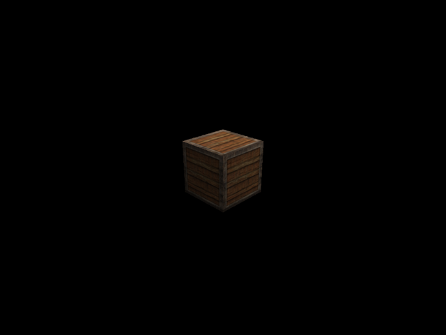
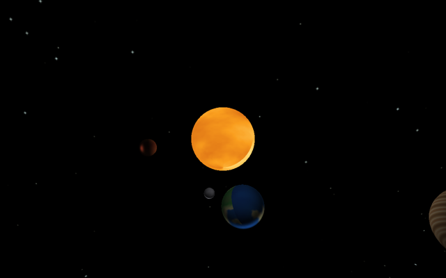

# Stargine examples

Each directory here is a standalone program that uses the engine as a library.
Read them in order. `cube` sets up the pieces every example needs, and the other
two add one idea each.

## Running them

```bash
pixi run assets              # once, to generate the procedural textures
pixi run example cube
pixi run example solar_system
pixi run example wave_field
```

`pixi run example` with no name lists what is available.

Every example needs a real display. If SDL picks the wrong video backend, set it
explicitly: `SDL_VIDEODRIVER=wayland pixi run example cube`.

Controls are the same in all three: **WASD** to move, **space** and **left
shift** for up and down, the mouse to look, **F11** for fullscreen, **Esc** to
quit.

## The examples

### `cube`: the basics



A textured crate lit by a point light and a directional light. The point light's
position is drawn as a small white cube that shares its `Transform`, and the
arrow keys spin the crate through an `EventHandler` written inside the example.

### `solar_system`: spheres, orbits and a skybox



A star with three worlds and a moon, wrapped in a cube-map star field. The
planets are indexed sphere meshes; their textures come from `assets/generate.py`,
which builds them out of value noise.

### `wave_field`: a custom shader


A 192×192 plane displaced by a hand-written vertex shader. Normals come from
central differences, so the surface shades itself as it moves, and the sphere
above it rides the same wave evaluated on the CPU.

## Writing your own

Copy a directory, rename it, and `pixi run example <name>` will pick it up, as
the runner looks for `examples/<name>/main.mojo`. Assets live in
`examples/assets/` and are addressed relative to the project root.
